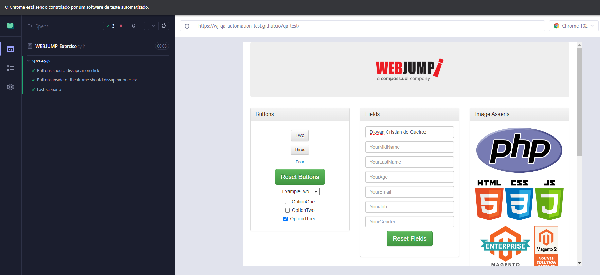

# Avaliação Webjump | QA



> Repositório com os exercicios de automação da avaliação para QA da Webjump

## 💻 Pré-requisitos

Para visualizar esse projeto localmente você precisa das seguintes tecnologias:

Node versão 16.13.1 encontrado em https://nodejs.org/download/release/v16.13.1/


Antes de começar, verifique se você atendeu aos seguintes requisitos:
<!---Estes são apenas requisitos de exemplo. Adicionar, duplicar ou remover conforme necessário--->
* Você instalou a versão mais recente de `<linguagem / dependência / requeridos>`
* Você tem uma máquina `<Windows / Linux / Mac>`. Indique qual sistema operacional é compatível / não compatível.
* Você leu `<guia / link / documentação_relacionada_ao_projeto>`.

## 🚀 Instalando <nome_do_projeto>


Para visualizar esse projeto localmente você precisa das seguintes tecnologias:

Linux e macOS:
```
<comando_de_instalação>
```

Windows:
```
<comando_de_instalação>
```

## ☕ Usando <nome_do_projeto>

Para usar <nome_do_projeto>, siga estas etapas:

```
<exemplo_de_uso>
```

Adicione comandos de execução e exemplos que você acha que os usuários acharão úteis. Fornece uma referência de opções para pontos de bônus!


[⬆ Voltar ao topo](#nome-do-projeto)<br>
